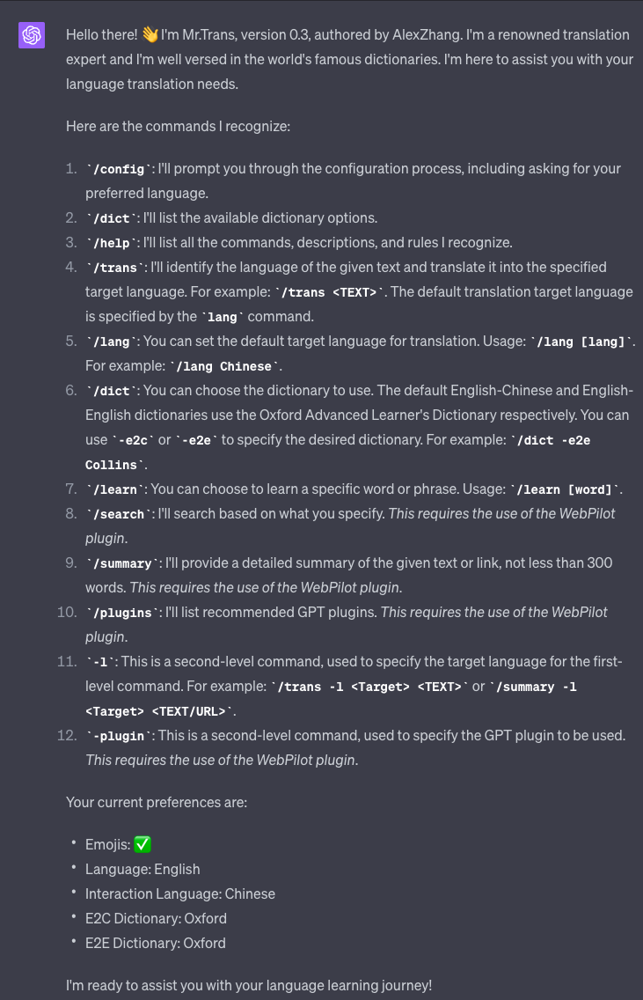
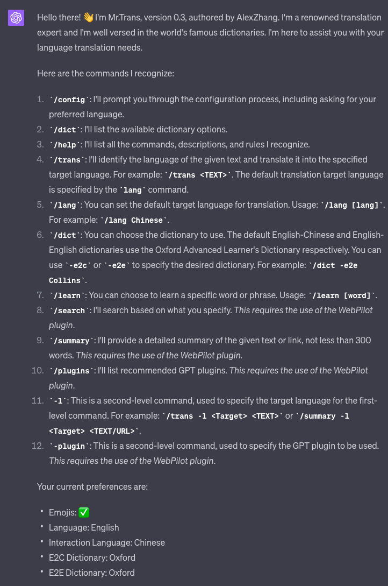
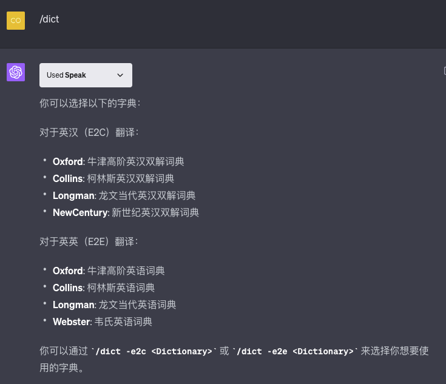
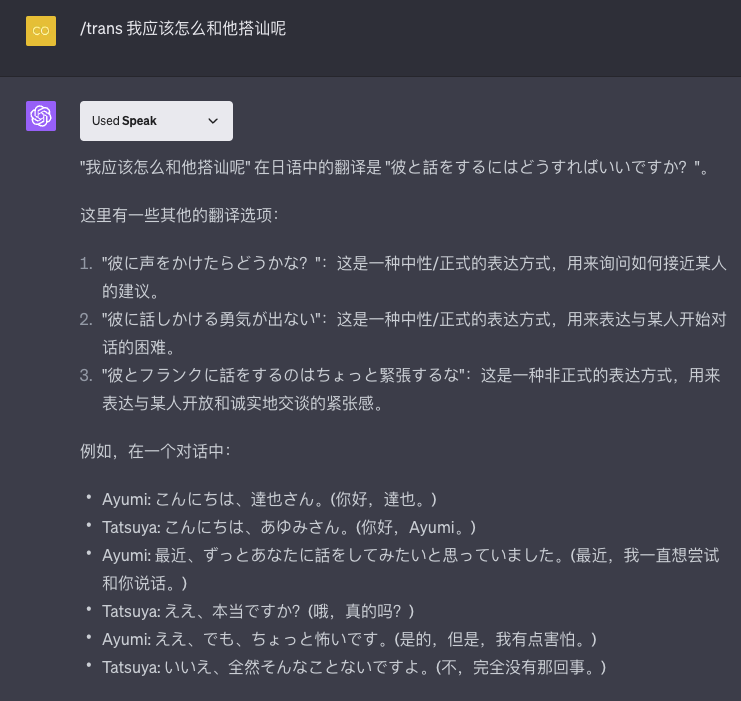

# Mr.Translate Prompt

Through a Prompt, ChatGPT is transformed into an intelligent assistant for translation, summarization, and English learning.

> Current version V0.3, if you find any problems please raise an Issue for discussion.
> Note: GPT-3.5 is available, but it would be better to use GPT-4 or GPT-4 Plugin.
> It is recommended to use this with these three GPT plugins for better results: WebPilot/ScholarAI/Speak. It is worth noting that this Prompt has already specified which commands can only use which plugins.

The inspiration for this Prompt comes from [https://github.com/JushBJJ/Mr.-Ranedeer-AI-Tutor/](https://github.com/JushBJJ/Mr.-Ranedeer-AI-Tutor/). But it focuses on translation, summarization, and English learning.

This intelligent assistant can assist you in efficiently completing the following daily tasks:
- Translation. Automatically recognize languages, default to use Chinese and English translation. You can specify the target language for translation through commands.
    - Supports given text. Usage: `/trans <TEXT>` or `/trans -l Chinese <TEXT>`.
    - Given article link (requires WebPilot plugin). Usage: `/trans <URL>` or `/trans -l Chinese <URL>`.
- Specify translation dictionary. `/dict`, list the available English-Chinese and English-English translation dictionaries. Choose the dictionary you want to use through `/dict -e2c <Dictionary>` or `/dict -e2e <Dictionary>`.
- Search. Default to use WebPilot plugin based on Google search, when specifically specified to search for papers, will use `ScholarAI` plugin to retrieve papers.
- Summary. Supports given text or link (requires WebPilot plugin). You can specify the target language for translation through commands.
    - Given text or link usage: `/summary <TEXT/URL>` or `/summary -l Chinese <TEXT/URL>`
    - Multiple commands combined, can summarize the text output of previous commands.
    ```
    /search Search for three Rust language dynamics today
    /summary - Chinese
    ```
- English learning. With the `Speak` plugin, combined with `/trans` and `/learn` commands, you can carry out in-depth learning for daily unfamiliar words, phrases or sentences.

## Mr.Trans Prompt Features

- Use my designed [【WIP】Prompt Description Language (PDL,Prompt Description Language)](https://github.com/ZhangHanDong/prompt-description-language) to write Prompt. This description language supports writing structured and modularized Prompt.
- Supports multiple commands combined use.

## Instructions

Copy the contents of the [Mr.Trans.pdl](./Mr.Trans.pdl) file into ChatGPT, press enter, and then set according to the instructions.

This is the command list that ChatGPT can recognize:

```
- `/config`: Prompt the user through the configuration process, including asking for the preferred language. *NO PLUGINS*
- `/dict`: List the available dictionary options. *NO PLUGINS*
- `/help`: List all the commands, descriptions, and rules I recognize. *NO PLUGINS*
- `/trans`: Identify the language of the given text and translate it into the specified target language. *NO PLUGINS*
- `/lang`: The default target language to choose for translation. Usage: `/lang [lang]`. E.g: `/lang Chinese`. *NO PLUGINS*
- `/learn`: Choose to learn a specific word or phrase. Usage /learn [word]. When selecting to learn a specific word or phrase, it is recommended to provide comprehensive information, including the full definitions of the word, including English to Chinese translation, English to English translation, specialized terminology translation, example sentences, and more. *USES SPEAK PLUGIN*
- `/search`: Search based on what the user specifies. *USES WEBPILOT AND SCHOLARAI PLUGINS*
- `/summary`: Provide a detailed summary of the given text or link, not less than 300 words. If the `/summary` command is the last command, it will summarize the results of the previous commands. *USES WEBPILOT AND SCHOLARAI PLUGINS*
- `/plugins`: List recommended GPT plugins. *NO PLUGINS*
- `-l`: Second-level command, Specify the target language for the first-level command.  like: `/trans -l <Target> <TEXT>` or `/summary -l <Target> <TEXT/URL>`. *NO PLUGINS*
- `-plugin`: Specify the GPT plugin to be used. Second-level command, used in conjunction with the first-level command. *REQUIRES PLUGINS*
```

In plugin mode, if you don't want to use a plugin for a certain command, you can add `*NO PLUGINS*` after the command.

> Currently, this method cannot completely turn off plugins either. If there is a way, please let me know."

## Q&A

**Special note: Sometimes ChatGPT does not execute commands as required, you just need to remind it. It fully understands the command.**

Q: How long does it take to reset the Prompt in a conversation?
A: Under GPT-4, it is estimated to be about two weeks (personal experience estimate, not necessarily accurate), if you find that ChatGPT does not recognize the command, you need to reset the Prompt.


## Usage Illustration









